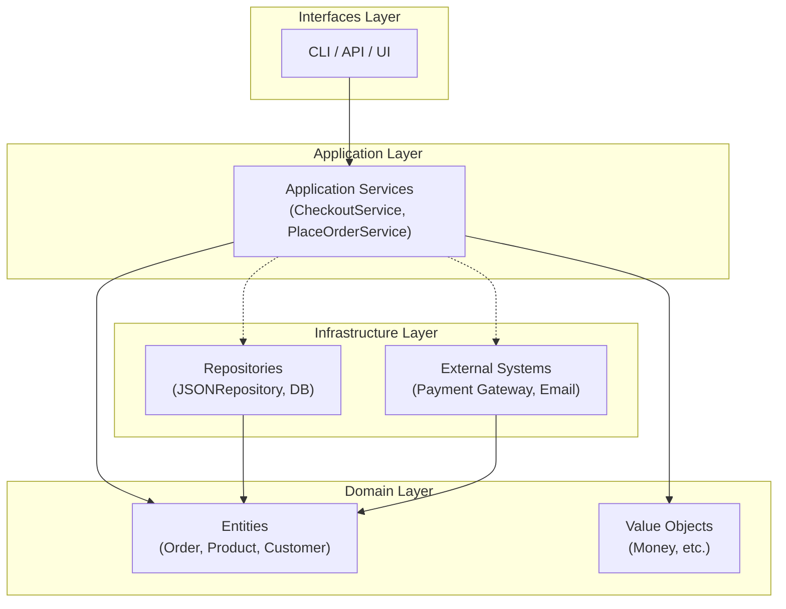

```mermaid
flowchart TB

%% Layers
subgraph Interfaces["Interfaces Layer"]
    UI["CLI / API / UI"]
end

subgraph Application["Application Layer"]
    SVC["Application Services\n(CheckoutService, PlaceOrderService)"]
end

subgraph Domain["Domain Layer"]
    ENT["Entities\n(Order, Product, Customer)"]
    VO["Value Objects\n(Money, etc.)"]
end

subgraph Infrastructure["Infrastructure Layer"]
    REPO["Repositories\n(JSONRepository, DB)"]
    EXT["External Systems\n(Payment Gateway, Email)"]
end

%% Primary flow (top-down)
UI --> SVC
SVC --> ENT
SVC --> VO

%% Infrastructure depends inward
REPO --> ENT
EXT --> ENT

%% Optional: application using infrastructure (via abstraction)
SVC -.-> REPO
SVC -.-> EXT

```