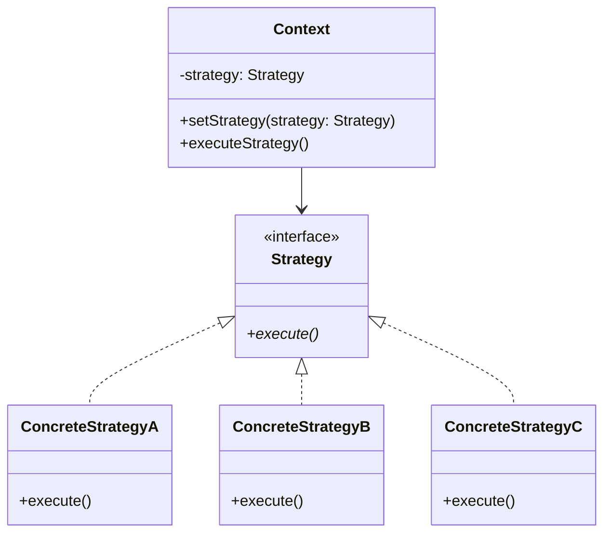

# Strategy Design Pattern

## Definition

The **Strategy Pattern** is a behavioral design pattern that defines a family of algorithms, encapsulates each one, and makes them interchangeable. Strategy lets the algorithm vary independently from clients that use it.

### Key Characteristics:
- **Problem**: When you have multiple ways to perform a task and need to switch between them at runtime
- **Solution**: Define a common interface for all variations and encapsulate each algorithm in its own class
- **Benefit**: Eliminates `if-else` or `switch-case` statements; resolves the Open/Closed Principle (OCP) violation

### When to Use:
- Multiple implementations of the same behavior
- Need to switch algorithms at runtime
- Want to avoid conditional statements for algorithm selection
- Algorithms need to be independent and interchangeable

---

## Class Diagram

---

## Examples:
- Payment processing
- Shipping cost calculation
- Dsicount calculation

## Advantages and Disadvantages

### Advantages
- Eliminates conditional statements
- Easy to add new strategies without modifying existing code
- Strategies can be changed at runtime
- Improved testability (each strategy can be tested independently)
- Follows SOLID principles

### Disadvantages
- Increases number of classes (one per strategy)
- Can be overkill for simple behavior switching
- Slight overhead from polymorphic calls
- Requires careful interface design

---

