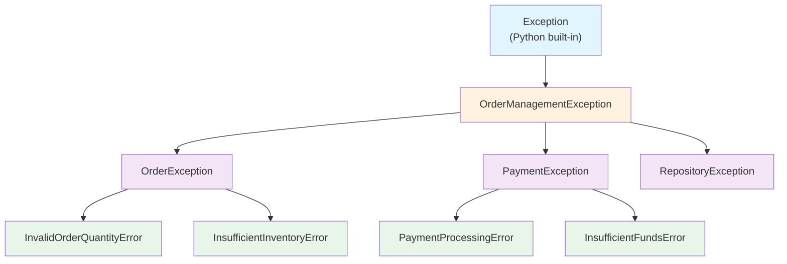
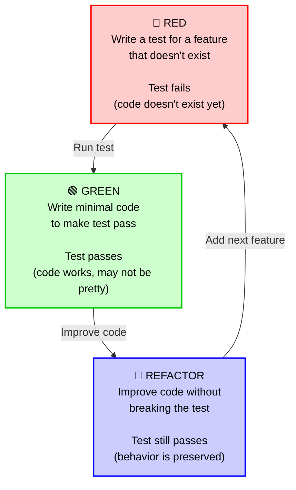

# Automated Testing

## What is Automated Testing?

Automated testing is the practice of writing code that automatically verifies whether your application works correctly. Instead of manually clicking through your application or running commands to check if everything works, you write test scripts that run automatically and tell you if something is broken.

### Manual Testing vs Automated Testing

**Manual Testing Example:**
```
- Open the application
- Enter a customer name
- Add items to cart
- Apply a discount
- Check if the total is calculated correctly
- Repeat this process for 50 different scenarios
```

**Automated Testing Example:**
```python
# This test runs automatically and checks many scenarios
def test_discount_calculation():
    cart = ShoppingCart()
    cart.add_item(Product("Laptop", 1000), quantity=1)
    cart.apply_discount(Discount("SAVE10", 0.10))
    assert cart.get_total() == 900  # Automatically verified
```

### Key Insight: Tests are Executable Specifications

Tests are more than just quality checks—they are **executable specifications**. They define exactly how your system should behave. When you read a test, you're reading a precise description of what the code does. This means:

- **Tests document behavior** - They show new developers exactly how features work
- **Tests prevent misunderstandings** - No ambiguity about requirements
- **Tests catch violations** - When behavior changes, tests fail immediately
- **Tests enable refactoring** - You can rewrite code safely as long as tests pass

In essence: **If it passes the tests, it meets the specification.**


## Why Automated Testing is Important

### 1. Catch Bugs Early
- Tests run every time you change code
- You find problems immediately instead of in production
- A bug costs 10x more to fix after release than during development

### 2. Make Refactoring Safe
- You can improve code without fear of breaking it
- Tests tell you if you broke something

```python
# Scenario: You want to refactor the discount logic
# With tests, you know immediately if your refactoring broke something
def test_discount_calculation():  # This test still passes
    assert apply_discount(100, 0.10) == 90
```

### 3. Save Time Long-Term
- Writing tests takes time upfront
- But saves massive amounts of time in debugging and maintenance
- One test running in 1 second might save 1 hour of manual testing

### 4. Document How Code Should Work
- Tests show exactly what your code is supposed to do
- New team members can understand the system through tests


### 5. Enable Continuous Integration/Deployment
- Automated tests allow you to deploy multiple times per day safely
- You can't scale without testing

## Types of Tests

### Unit Tests
Test individual components in isolation

```python
# Testing a single function or method
def test_calculate_discount_amount():
    discount = Discount("SAVE10", 0.10)
    amount = discount.calculate_reduction(100)
    assert amount == 10
```

### Integration Tests
Test how multiple components work together

```python
# Testing that Order and Payment work together
def test_order_with_payment():
    order = Order()
    order.add_line_item(Product("Book", 50), quantity=2)
    payment = Payment(order.get_total(), "credit_card")
    assert payment.process() == True
```

### End-to-End Tests
Test complete workflows from start to finish

```python
# Testing the entire checkout process
def test_complete_checkout_workflow():
    customer = Customer("John", "john@example.com")
    cart = ShoppingCart(customer)
    cart.add_product(Product("Laptop", 1000))
    cart.apply_discount(Discount("SAVE20", 0.20))
    order = cart.checkout()
    assert order.status == "completed"
    assert order.total == 800
```

## Testing Fundamentals: The AAA Pattern

Every good test follows three steps:

### Arrange (Setup)
Set up the test data and prerequisites

### Act (Execute)
Perform the action you want to test

### Assert (Verify)
Check that the result is what you expected

```python
def test_shopping_cart_total():
    # ARRANGE - Set up the test data
    cart = ShoppingCart()
    product = Product("Book", 25.00)
    
    # ACT - Perform the action
    cart.add_item(product, quantity=2)
    
    # ASSERT - Verify the result
    assert cart.get_total() == 50.00
```

## Designing Good Tests

### 1. Test One Thing at a Time
Each test should verify ONE specific behavior.

```python
# BAD: Testing multiple things in one test
def test_order_processing():
    order = Order()
    order.add_item(Product("Laptop", 1000), 1)
    assert order.get_total() == 1000  # What if this fails?
    
    order.apply_discount(Discount("SAVE10", 0.10))
    assert order.get_total() == 900    # Which assertion failed - our problem?
    
    payment = order.process_payment()  # And if this fails?
    assert payment.status == "success"

# GOOD: Each test verifies one specific behavior
def test_order_calculation():
    order = Order()
    order.add_item(Product("Laptop", 1000), 1)
    assert order.get_total() == 1000

def test_discount_application():
    order = Order()
    order.add_item(Product("Laptop", 1000), 1)
    order.apply_discount(Discount("SAVE10", 0.10))
    assert order.get_total() == 900

def test_payment_processing():
    order = Order()
    order.add_item(Product("Laptop", 1000), 1)
    payment = order.process_payment()
    assert payment.status == "success"
```

**Why?** If a test fails, you immediately know exactly what's broken.

### 2. Use Descriptive Test Names
Test names should describe what they test, not how they test it.

```python
# BAD: Not clear what's being tested
def test_1():
    pass

def test_order():
    pass

# GOOD: Clear intention of what's tested
def test_discount_reduced_order_total_by_percentage():
    pass

def test_zero_quantity_items_not_included_in_total():
    pass

def test_customer_receives_email_after_purchase():
    pass
```

**Rule:** You should understand what the test does just by reading its name.

### 3. Keep Tests Independent
Each test should work by itself. Tests should not depend on other tests.

```python
# BAD: Test depends on another test
def test_create_customer():
    global test_customer
    test_customer = Customer("John", "john@example.com")
    assert test_customer is not None

def test_customer_email():
    # This test depends on test_create_customer running first!
    assert test_customer.email == "john@example.com"

# GOOD: Each test is self-contained
def test_create_customer():
    customer = Customer("John", "john@example.com")
    assert customer is not None

def test_customer_email():
    customer = Customer("John", "john@example.com")
    assert customer.email == "john@example.com"
```

**Why?** If tests depend on each other, a failure in one breaks all subsequent tests.

### 4. Test Edge Cases and Boundaries
Don't just test the happy path. Test what happens with unusual inputs.

```python
def test_discount_with_valid_percentage():
    """Test normal case"""
    discount = Discount("SAVE10", 0.10)
    assert discount.calculate_reduction(100) == 10

def test_discount_with_zero_percentage():
    """Test edge case: zero discount"""
    discount = Discount("NODEDUCT", 0.00)
    assert discount.calculate_reduction(100) == 0

def test_discount_with_full_discount():
    """Test edge case: 100% discount"""
    discount = Discount("FREE", 1.00)
    assert discount.calculate_reduction(100) == 100

def test_discount_with_invalid_percentage():
    """Test error case: invalid input"""
    with pytest.raises(ValueError):
        Discount("INVALID", 1.50)  # More than 100%
```

### 5. Avoid Test Fixtures That Are Too Complex

**What is a fixture?** A fixture is a reusable setup function that creates test data. Instead of repeating setup code in every test, you define it once and pytest automatically provides it to tests that need it.

```python
# Define once, use in many tests
@pytest.fixture
def order():
    customer = Customer("John", "john@example.com")
    return Order(customer)

# Use the fixture by adding it as a parameter
def test_order_starts_empty(order):
    assert order.get_total() == 0

def test_order_can_add_items(order):
    order.add_item(Product("Book", 25), 1)
    assert order.get_total() == 25
```

Keep fixture setup simple and obvious:

```python
# BAD: Hard to understand what data is being set up
@pytest.fixture
def complex_order():
    customer = Customer("Alice", "alice@example.com", "123 Main St", "5551234567", "VIP", True)
    order = Order(customer, "2024-01-15", "standard", "warehouse_1", ["COD", "PREPAID"])
    order.add_item(Product("Item1", 100, "cat1", "sku1", inventory=50), 3)
    order.add_item(Product("Item2", 200, "cat2", "sku2", inventory=100), 2)
    order.items[0].applied_discount = Discount("BULK5", 0.05)
    order.items[1].applied_discount = Discount("BULK10", 0.10)
    return order

# GOOD: Clear setup with meaningful names
@pytest.fixture
def simple_order():
    """Creates a basic order with one item for testing"""
    customer = Customer("John", "john@example.com")
    order = Order(customer)
    order.add_item(Product("Book", 25.00), quantity=1)
    return order

@pytest.fixture
def discounted_order():
    """Creates an order with multiple discounted items"""
    customer = Customer("Alice", "alice@example.com")
    order = Order(customer)
    order.add_item(Product("Laptop", 1000), quantity=1)
    order.apply_discount(Discount("SAVE10", 0.10))
    return order
```

## Getting Started with Pytest

### Installation

```bash
pip install pytest
```

### Your First Test

```python
def test_add_item_to_order():
    order = Order()
    order.add_item(Product("Book", 25), 1)
    assert order.get_total() == 25
```

### Running Tests

```bash
pytest              # run all tests
pytest -v           # verbose output
pytest -k "keyword" # filter by name
```

## Error Handling and Custom Exceptions

### Why Custom Exceptions Matter

Error handling is **critical for writing testable, maintainable code**. When something goes wrong, your code should:
1. **Fail loudly** - Don't silently ignore problems
2. **Fail clearly** - Say exactly what went wrong
3. **Fail informatively** - Help developers fix it
4. **Be testable** - You should test that errors happen when they should

### Standard Python Exceptions vs Custom Exceptions

**Standard Exceptions (Built-In):**
```python
# Generic - doesn't tell you much
raise ValueError("invalid value")
raise Exception("something went wrong")
```

**Custom Exceptions (Better for your domain):**
```python
# Specific - exactly what went wrong
raise InsufficientInventoryError(f"Only {available} units available, requested {requested}")
raise PaymentProcessingError("Credit card declined")
raise InvalidDiscountError("Discount percentage cannot exceed 100%")
```

### Designing Custom Exceptions

A well-designed custom exception:
- **Inherits from a standard exception** (usually `Exception` or a more specific type)
- **Has a clear name** that describes what went wrong
- **Includes context** about the error
- **Provides helpful information** for fixing it

```python
# GOOD: Custom exception for the order domain

class OrderException(Exception):
    """Base exception for all order-related errors"""
    pass

class InvalidOrderQuantityError(OrderException):
    """Raised when order quantity is invalid"""
    def __init__(self, quantity):
        self.quantity = quantity
        super().__init__(f"Order quantity must be positive, got {quantity}")

class InsufficientInventoryError(OrderException):
    """Raised when there isn't enough inventory"""
    def __init__(self, product_name, requested, available):
        self.product_name = product_name
        self.requested = requested
        self.available = available
        super().__init__(
            f"Insufficient inventory for '{product_name}': "
            f"requested {requested} but only {available} available"
        )

class InvalidDiscountError(OrderException):
    """Raised when discount is invalid"""
    def __init__(self, rate, max_rate=1.0):
        self.rate = rate
        super().__init__(
            f"Discount rate must be between 0 and {max_rate}, got {rate}"
        )

class PaymentProcessingError(OrderException):
    """Raised when payment processing fails"""
    def __init__(self, reason):
        self.reason = reason
        super().__init__(f"Payment processing failed: {reason}")
```

### Using Custom Exceptions in Code

```python
# domain/order.py

class Order:
    def __init__(self, customer):
        self.customer = customer
        self.items = []
    
    def add_line_item(self, product, quantity):
        """Add an item to the order"""
        if quantity <= 0:
            raise InvalidOrderQuantityError(quantity)
        
        # Check inventory availability
        if product.inventory < quantity:
            raise InsufficientInventoryError(
                product_name=product.name,
                requested=quantity,
                available=product.inventory
            )
        
        self.items.append(OrderLine(product, quantity))
    
    def apply_discount(self, discount):
        """Apply a discount to the order"""
        if discount.rate < 0 or discount.rate > 1.0:
            raise InvalidDiscountError(discount.rate)
        
        self.discount = discount
```

### Testing Error Cases with pytest.raises()

```python
# Test that errors are raised with correct message
with pytest.raises(InvalidOrderQuantityError) as exc_info:
    order.add_product(product, -5)

error = exc_info.value
assert error.quantity == -5
assert "positive" in str(error).lower()
```


### Best Practices for Error Handling

| Principle | Example |
|---|---|
| **Use specific exceptions** | `InsufficientInventoryError` not `Exception` |
| **Include context** | Error knows product name, requested, available |
| **Use clear messages** | "Inventory for 'Laptop': need 5, have 3" |
| **Test the happy path** | Item CAN be added with valid quantity |
| **Test error conditions** | Item CANNOT be added with invalid quantity |
| **Test error messages** | Verify error explains the problem |
| **Test error attributes** | Verify exception stores relevant data |

### Pattern: Custom Exception Hierarchy

For larger systems, create an exception hierarchy:



This allows callers to catch exceptions at different levels of specificity:

```python
# Catch all order management errors
try:
    process_order(order)
except OrderManagementException as e:
    print(f"Order processing failed: {e}")

# Catch only payment errors
try:
    process_payment(order)
except PaymentException as e:
    print(f"Payment failed: {e}")

# Catch specific error
try:
    add_inventory(product, quantity)
except InsufficientInventoryError as e:
    print(f"Need {e.requested}, have {e.available}")
```

### When Should Code Raise Exceptions?

Good error handling raises exceptions when:

**Do raise exceptions:**
- Invalid input (negative quantity, invalid email)
- State violations (insufficient inventory, insufficient funds)
- Preconditions not met (required fields missing)
- External service failures (database error, API error)

**Don't raise exceptions for:**
- Expected control flow (not an error mechanism)
- recoverable mistakes that are part of normal operation

```python
# BAD: Using exceptions for control flow
try:
    while True:
        item = get_next_item()
except NoMoreItemsException:
    pass  # Expected, not an error

# GOOD: Using normal control flow
while has_more_items():
    item = get_next_item()
```


## Common Testing Mistakes to Avoid

### Testing Implementation Instead of Behavior

```python
# BAD: Testing HOW the code works (implementation detail)
def test_discount_loop():
    total = 100
    for item in [0.05, 0.05]:  # Knows about loop
        total = total * (1 - item)
    assert total == 90.25

# GOOD: Testing WHAT the code does (behavior)
def test_discount_calculation():
    discount = Discount("HALF_OFF", 0.50)
    result = discount.calculate_reduction(100)
    assert result == 50
```

### Having Too Many Assertions

```python
# BAD: Multiple assertions, hard to know which failed
def test_order():
    order = Order(customer)
    order.add_item(product, 1)
    assert order.get_total() == 1000
    assert len(order.items) == 1
    assert order.customer.name == "John"

# GOOD: One assertion per behavior
def test_order_calculates_total():
    order = Order(customer)
    order.add_item(product, 1)
    assert order.get_total() == 1000

def test_order_has_one_item():
    order = Order(customer)
    order.add_item(product, 1)
    assert len(order.items) == 1
```

### Not Testing Error Cases

```python
# BAD: Only testing the happy path
def test_discount():
    discount = Discount("SAVE10", 0.10)
    assert discount.rate == 0.10

# GOOD: Testing both valid and invalid cases
def test_discount_with_valid_rate():
    discount = Discount("SAVE10", 0.10)
    assert discount.rate == 0.10

def test_discount_with_invalid_rate():
    with pytest.raises(ValueError):
        Discount("INVALID", 1.50)  # Over 100%
```

## Test-Driven Development (TDD)

### What is TDD?

**Test-Driven Development** is a discipline where you write tests **before** you write the code being tested. It may sound backwards, but it's one of the most powerful development practices.

The Workflow:
1. **Write a failing test** (Red)
2. **Write minimal code to make it pass** (Green)
3. **Improve the code** (Refactor)

### The Red-Green-Refactor Cycle



### TDD Example: Building an Order System

**RED** - Write failing test:
```python
def test_order_calculates_total():
    order = Order()
    order.add_product(Product("Laptop", 1000), 1)
    assert order.get_total() == 1000
```

**GREEN** - Minimal code:
```python
class Order:
    def add_product(self, product, qty):
        self.items = [(product, qty)]
    def get_total(self):
        return self.items[0][0].price * self.items[0][1]
```

**REFACTOR** - Improve while keeping test passing:
```python
class Order:
    def __init__(self):
        self.lines = []
    def add_item(self, product, qty):
        if qty <= 0: raise ValueError()
        self.lines.append((product, qty))
    def get_total(self):
        return sum(p.price * q for p, q in self.lines)
```


## Next Steps

1. **Start Small:** Write tests for your simplest functions first
2. **Aim for Coverage:** Eventually test all major code paths
3. **Test Continuously:** Run tests every time you change code
4. **Test Driven Development (TDD):** Write tests before writing code
5. **Keep Improving:** As you get comfortable, write better tests

Remember: *The goal of testing is not to have 100% coverage. The goal is to catch important bugs and feel confident that your code works.*
